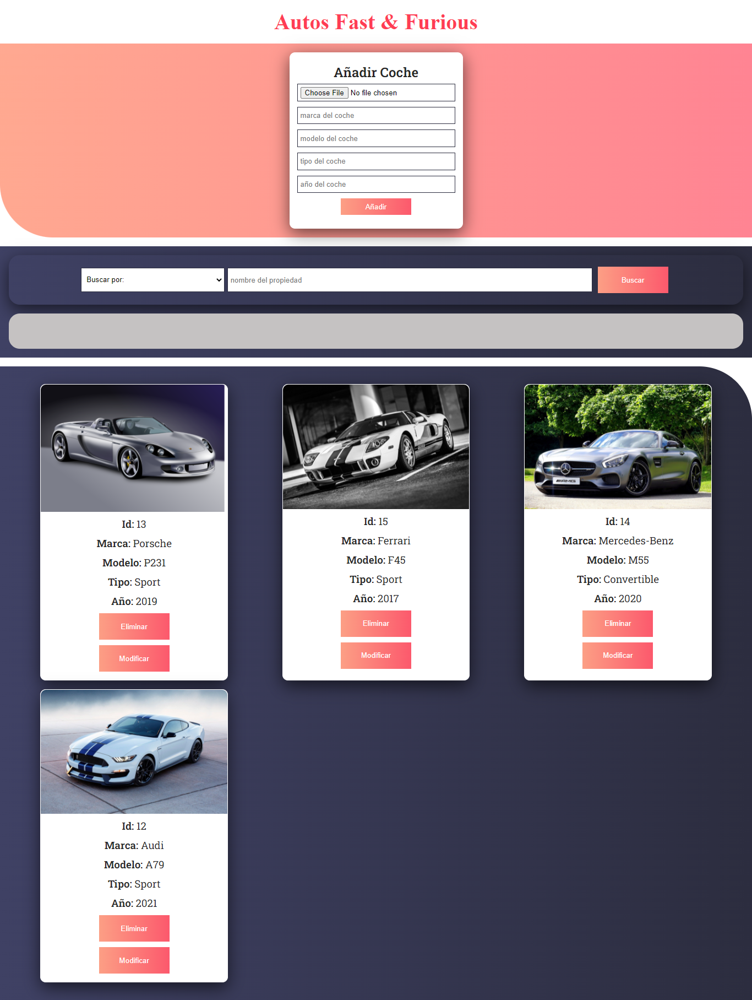

# Cars catalogue

### Tools

- [Stapi](https://strapi.io/)
- [React.js](https://reactjs.org/)
- [Axios](https://axios-http.com/)

### Development

I decided to build this app using React.js and connecting the database of the cars to Strapi.io.
User can add, edit and delete the records of the cars with ease. The HTTP promises are handled using Axios.

Feedbacks are appreciated!

Happy coding!
